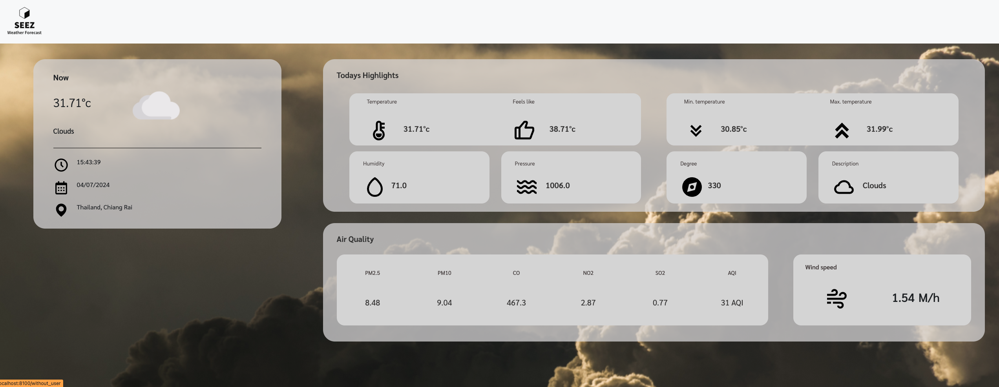
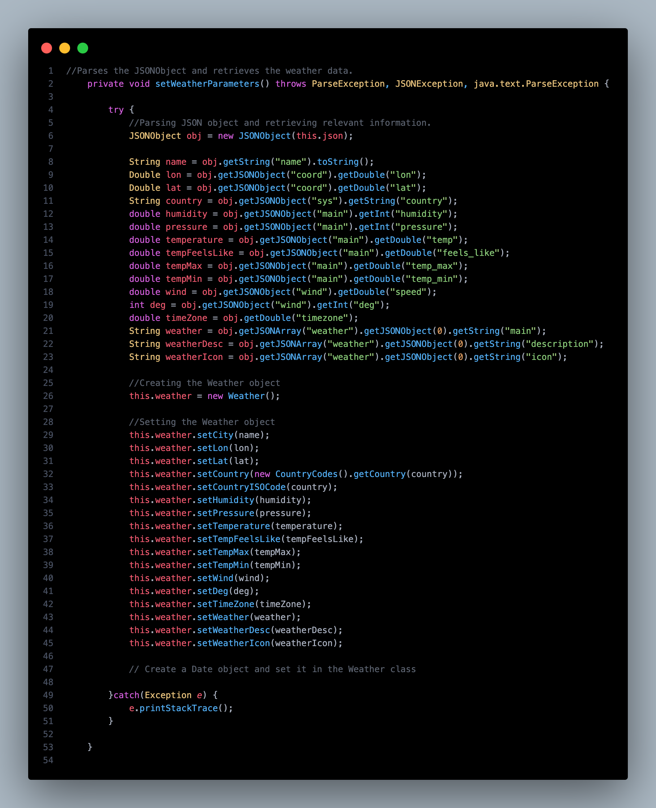
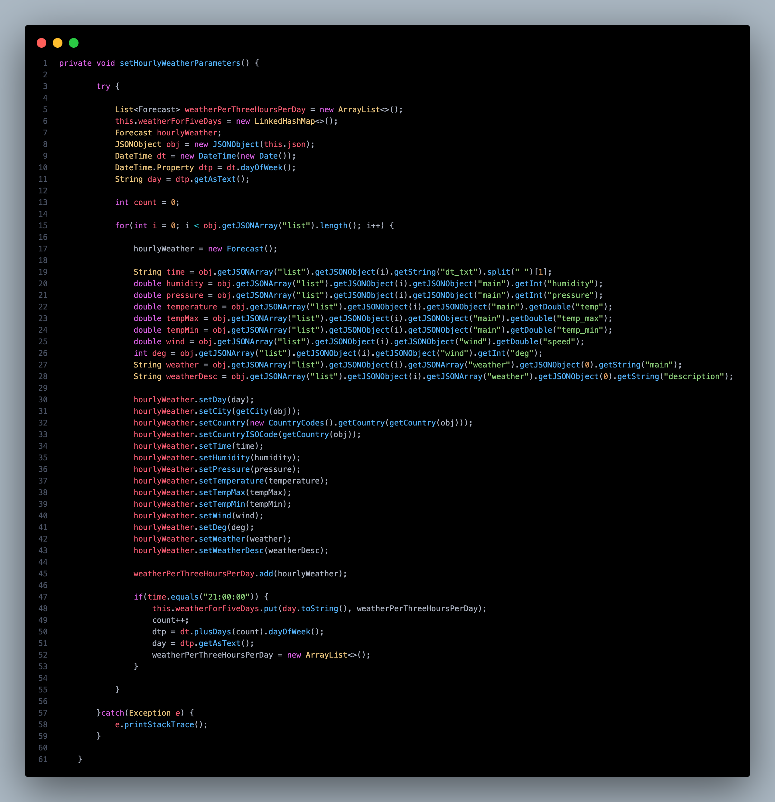
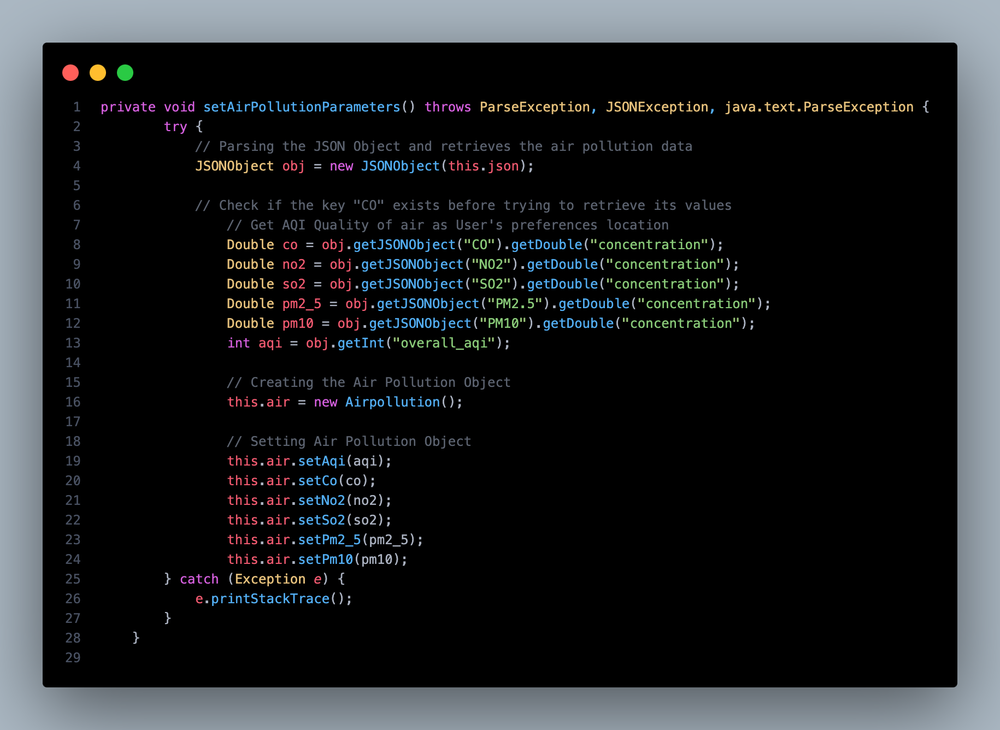
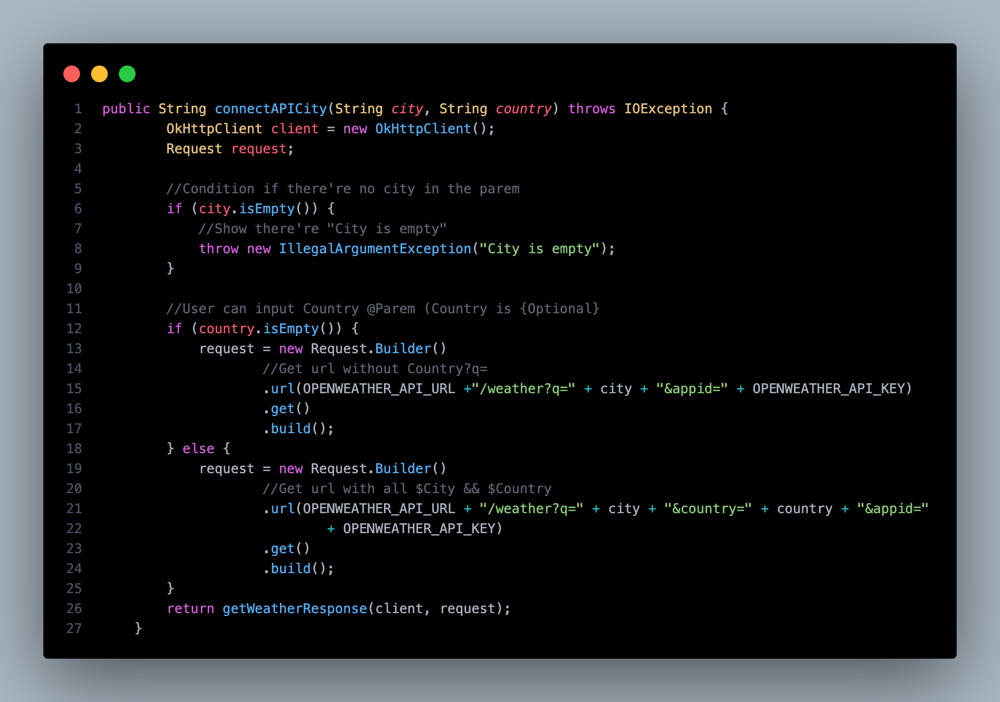
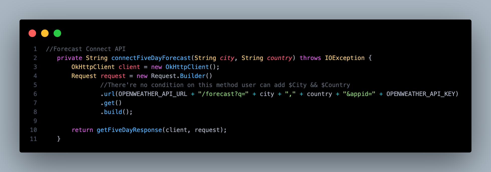
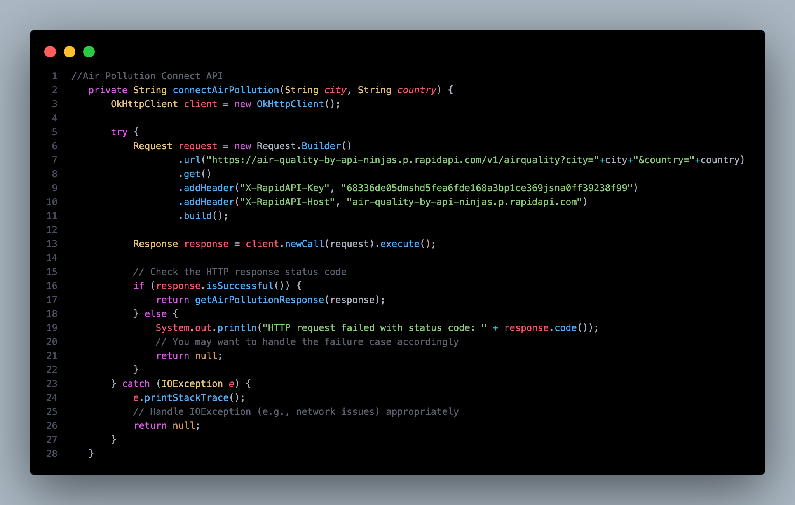

# Forecast-Weather-System Group <14>



## Project Description

Forecasting weather is like tutoring a vast audience, often requiring repetitive efforts that consume valuable time. Our Weather Forecast website is the solution to this challenge. Imagine recording a forecast once and effortlessly uploading it to our dedicated platform. Meteorologists can break free from repetition, saving time and refining predictions. This digital hub empowers forecasters to manage and update forecasts seamlessly. Welcome to a future where forecasting is efficient, accurate, and liberating. Embrace the Weather Forecast website – where predicting the elements becomes a seamless and empowering experience.

# Weather and Air Pollution Data Processor

This project includes methods to fetch and process weather and air pollution data from a given JSON object and API endpoints.

## Features

1. Extract weather parameters from a JSON object.
2. Extract hourly weather parameters.
3. Extract air pollution data.
4. Connect to weather API for current weather.
5. Connect to weather API for a 5-day weather forecast.

## Methods Explanation

### setWeatherParameters()



The `setWeatherParameters()` method extracts weather information from a JSON object and populates a `Weather` object.

- **Code Snippet:**
    ```java
    public void setWeatherParameters() {
        JSONObject obj = new JSONObject(this.json);
        // Extract data points
        String city = obj.getString("city");
        double humidity = obj.getDouble("humidity");
        double temperature = obj.getDouble("temperature");
        // Populate Weather object
        Weather weather = new Weather();
        weather.setCity(city);
        weather.setHumidity(humidity);
        weather.setTemperature(temperature);
    }
    ```

### setHourlyParameters()



The `setHourlyParameters()` method creates a `JSONObject` using the `this.json` string to extract weather-specific data points like location, humidity, pressure, temperature, wind speed/direction, and weather description, and populates a `Weather` object with the extracted data.

### setAirPollutionParameters()



The `setAirPollutionParameters()` method processes air pollution data:

- **Steps:**
    1. Retrieve a JSON object from `this.json`.
    2. Extract values for CO, NO2, SO2, PM2.5, PM10, and AQI.
    3. Create an `AirPollution` object.
    4. Assign extracted values to the `AirPollution` object.

### connectAPI()



The `connectAPI()` method connects to the weather API for current weather data:

- **Method Definition:**
    ```java
    public String connectAPI(String city, String country) throws IOException {
        OkHttpClient client = new OkHttpClient();

        if (city.isEmpty()) {
            throw new IllegalArgumentException("City cannot be empty");
        }

        String url = country.isEmpty() 
                     ? "http://api.openweathermap.org/data/2.5/weather?q=" + city + "&appid=YOUR_API_KEY"
                     : "http://api.openweathermap.org/data/2.5/weather?q=" + city + "," + country + "&appid=YOUR_API_KEY";

        Request request = new Request.Builder().url(url).build();
        return getWeatherResponse(client, request);
    }
    ```

### connectFiveDayAPI()



The `connectFiveDayAPI()` method connects to the weather API for a 5-day weather forecast:

- **Method Definition:**
    ```java
    public String connectFiveDayAPI(String city, String country) throws IOException {
        OkHttpClient client = new OkHttpClient();

        String url = "http://api.openweathermap.org/data/2.5/forecast?q=" + city + "," + country + "&appid=YOUR_API_KEY";

        Request request = new Request.Builder().url(url).build();
        return getFiveDayResponse(client, request);
    }
    ```

### connectAirPollutionAPI()



The `connectAirPollutionAPI()` method connects to the air pollution API for current air quality data:

- **Method Definition:**
    ```java
    public String connectAirPollutionAPI(String city) throws IOException {
        OkHttpClient client = new OkHttpClient();

        if (city.isEmpty()) {
            throw new IllegalArgumentException("City cannot be empty");
        }

        String url = "http://api.openweathermap.org/data/2.5/air_pollution?city=" + city + "&appid=YOUR_API_KEY";

        Request request = new Request.Builder().url(url).build();
        return getAirPollutionResponse(client, request);
    }
    ```

## Team Members

| Student ID   | First Name | Last Name     | Github account           | Role                     |
|--------------|------------|---------------|--------------------------|--------------------------|
| 6531503005   | Kritsakorn | Sukkasem      | Kritsasoft               | Document & UX/UI         |
| 6531503006   | Klavivach  | Prajong       | MABiuS1                  | Backend (Authentication) |
| 6531503008   | Kongphop   | Saenphai      | kongphop1209             | Document & UX/UI         |
| 6531503042   | Nimit      | Tanboontor    | 6531503042               | Backend & Frontend       |
| 6531503117   | Phumiphat  | Wongsathit    | 2547phumiphat            | Document & UX/UI         |
| 6531503120   | Ramet      | Naochomphoo   | 6531503120               | Document & UX/UI         |


## Deployed on Google Cloud
"none"

## Installation

### Backend

To run the backend, follow these steps:

1. Open a terminal and navigate to the `Backend` folder:
    ```bash
    cd Backend
    ```

2. If you have Maven installed:
    ```bash
    mvn clean spring-boot:run
    ```

   If you prefer using SDKMAN with Maven:
    ```bash
    sdk use java 17.0.0-zulu
    mvn clean spring-boot:run
    ```
3. Browser Backend Localhost:

   **{ISOCountryCODE} is Optional**
   
    ```JSP
    [weather-view page]
    http://localhost:8100/
    ```

     ```JSP
    [forecast-view page]
    http://localhost:8100/without_user/five_day/forecast?city={YOUR_CITY}&country={ISOCountryCODE}
    ```

     ```JSP
    [current-weather-view page]
    http://localhost:8100/without_user/current/weather?city={YOUR_CITY}&country={ISOCountryCODE}
    ```

    

   You can customize the Maven commands as needed, such as adding additional parameters for cleaning or validation.


